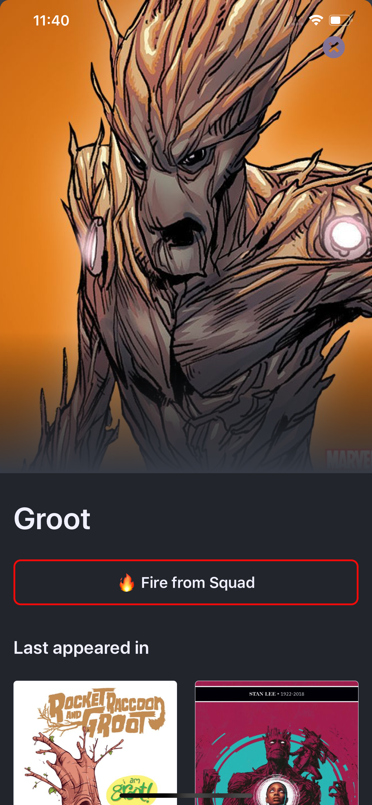
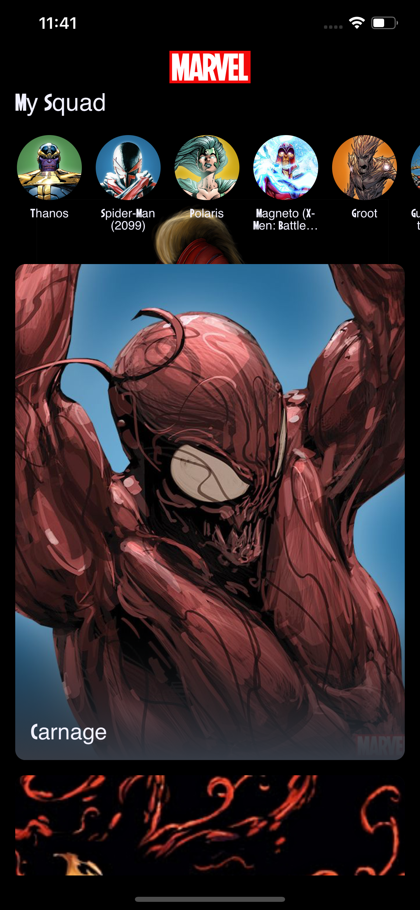

# Overview

This is a technical task project, based on Marvel Superhero characters. 
The goal is to use the Marvel API to make an app that allows users to create their squad of Marvel Superhero characters.

In short, the app should list all the marvel characters and the user should be able to **Recruit** or **Fire** characters from their squad.

## Task Description

The fundamental basis of any squad, is a team of kick-ass superheroes. Hence this task,
**The Superhero Squad Maker.** Your mission is to build the ultimate superhero squad using
the [Marvel API](https://developer.marvel.com/) for data.

The app is simple. When opened, it shows your current squad at the top (if any) and a list of all
characters from the Marvel API. Tapping on a character shows details and gives you the
option to recruit or fire the character.

You're expected to use some sort of in-app data persistence mechamisn so the squad persists
between app restarts.

To use the Marvel API you need to sign up for a developer account. Once you sign up you
will find your API keys in the Account section.

**Note**
For your app to work with the API, it's important to add "*" as an Authorized Referrer
in the Account section.

## Results

                  

                  

                  

## Usage and Requirements:
* Xcode 11.3 with swift 5
* iOS 13.2
* [Marvel API](https://developer.marvel.com/) private and public keys

## Development Log

The following are the development strategies, tools and examples used to develop the app.

### API Client
- One of the first things I didm was to add a networking layer tailored specifically to handle requests from Marvel Comics API. I followed some great tutorials to implement this networking layer, including [Malcolm Kumwenda - Writing a Network Layer in Swift: Protocol-Oriented Approach](https://medium.com/flawless-app-stories/writing-network-layer-in-swift-protocol-oriented-approach-4fa40ef1f908), and [Reinder de Vries - Networking In Swift With URLSession](https://learnappmaking.com/urlsession-swift-networking-how-to/).
- Another important thing to add was [**Pagination**](https://www.raywenderlich.com/5786-uitableview-infinite-scrolling-tutorial) of characters or comics data fetched from the Marvel API. This helps in loading segments/parts of the characters or comics data as you scroll through them in the app, if I was to load all of them at once it would be very risky and could cause the app to hang because the data download could take a while.

### Design Patterns
- I was using the **MVVM** design pattern, in both folder structure and implemntation of **Model, View, ViewModel** classes.
- **Singleton pattern**, in one instance only where I wrapped all the newtork request and logic in a **DataProvider** Singleton, which made it easy to make network calls to the marvel API from any point in the codebase.
- **Decorator** pattern, where I was making the most of Extentions and Delegates system. 
- **Codable** do deserialise json and converting them into custom Swift data classes.
- **Modulisation** of code into frameworks to encourage decoupling and make the codebase more testable.

### Libraries
- Using [**Carthage**](https://github.com/Carthage/Carthage) as the dependecy manager, which is much easier as oppose to using [Cocoa Pods](https://cocoapods.org) which setups and modifies the project by creating a new workspace and adding unnecessary configurations.
- [**CrytoSwift**](https://github.com/krzyzanowskim/CryptoSwift), was added to help convert String in [md5](https://en.wikipedia.org/wiki/MD5) format, which was required to successfully make calls to the Marvel API.
- [**SDWebImage**](https://github.com/SDWebImage/SDWebImage), was added to cache images of the Marval API. SDWebimage could do this asynchronous by downloading and caching images from the Marvel API.

### Persistance
- I used [Core Data](https://developer.apple.com/library/archive/documentation/Cocoa/Conceptual/CoreData/index.html) for persisting data of the app, it seemed most appropiated because its a simple way to store and persist data in database format. In general, it makes it easy to store and manage model layer objects of the app. You can save, track, modify and filter data within the apps using Core Data.

### Design
- My first design objective was to find custom fonts, particulatly [Marvel Fonts](https://www.fontspace.com/category/marvel) which really enhanced the theme of the app.
- [**Haptic feedback**](https://developer.apple.com/videos/play/wwdc2019/223/) was also a great way to enhance the user experience and iteraction in the app. I used both **Notifications** and **Selection** haptic feedbacks.
- [**Stretchy Header**](https://www.youtube.com/watch?v=R5CC1_QhrvY) was also a great design feature to add to improve the user experience.
- **Gradient Layer** was another feature provided an elegant way to combine text and images.
- The last and most important design feature that I wanted to try was viewcontroller **Transition Animation**. Its one the best ways of presenting viewcontrollers on the screen, which again greatly improves the user experince of the app. The animation that I used was in adapted from the work done by [**appssemble**](https://github.com/appssemble/appstore-card-transition).

### Testing 
- I was mostly following the Test Driven Development methodology, by testing the main business logics first or after initial implemenation of features to ensure and validate that the app works as intented. 
- I tested the networking layer, the marvel api endpoints, the model data objects and helper/extension properties.

