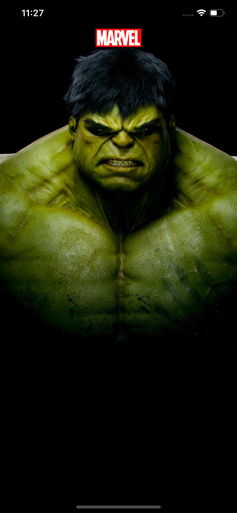
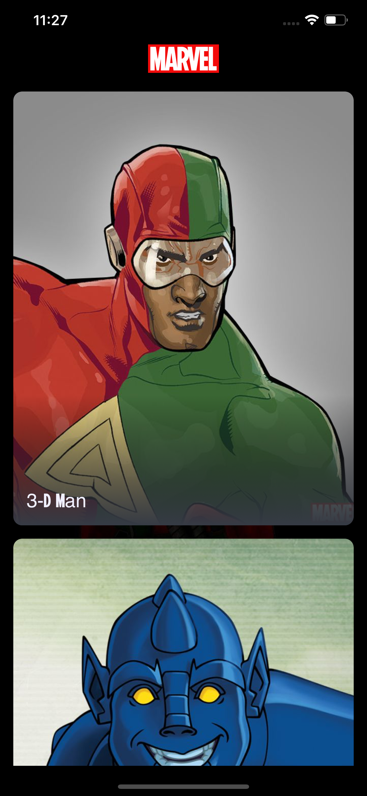
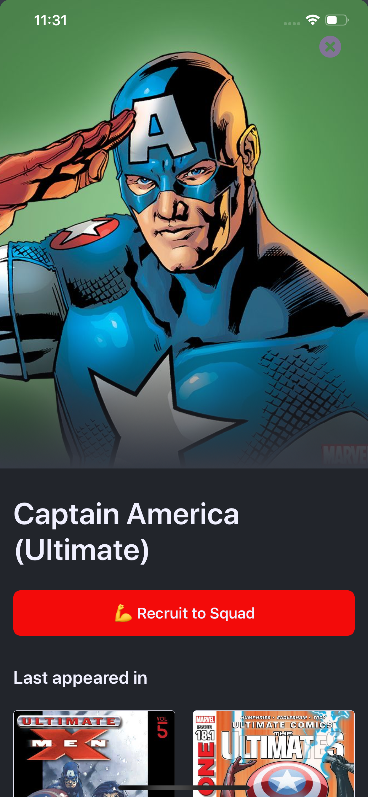

# Overview

This is a technical task project, based on Marvel Superhero characters. 
The goal is to use the Marvel API to make an app that allows users to create their squad of Marvel Superhero characters.

In short, the app should list all the marvel characters and the user should be able to **Recruit** or **Fire** characters from their squad.

## Task Description

The fundamental basis of any squad, is a team of kick-ass superheroes. Hence this task,
**The Superhero Squad Maker.** Your mission is to build the ultimate superhero squad using
the [Marvel API](https://developer.marvel.com/) for data.

The app is simple. When opened, it shows your current squad at the top (if any) and a list of all
characters from the Marvel API. Tapping on a character shows details and gives you the
option to recruit or fire the character.

You're expected to use some sort of in-app data persistence mechamisn so the squad persists
between app restarts.

To use the Marvel API you need to sign up for a developer account. Once you sign up you
will find your API keys in the Account section.

**Note**
For your app to work with the API, it's important to add "*" as an Authorized Referrer
in the Account section.

## Results

                  

                  

## Usage and Requirements:
* Xcode 11.3 with swift 5
* iOS 13.2
* [Marvel API](https://developer.marvel.com/) private and public keys

## Development Log

The following are the development strategies, tools and examples used to develop the app.

